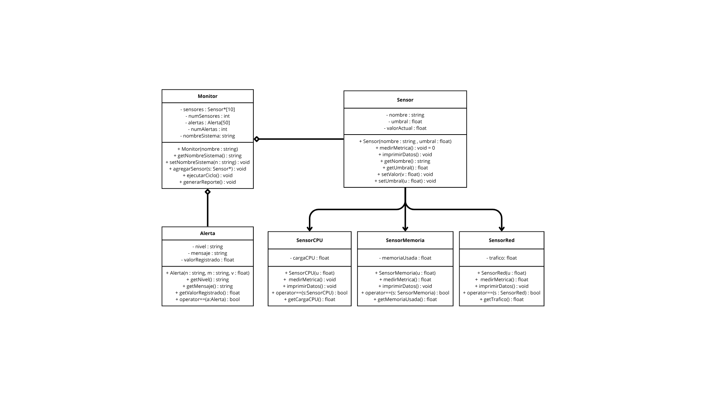

# Data Stream Monitor

A simulated computer resource monitoring system (CPU, RAM, and network traffic), inspired by tools like the Task Manager. The system applies configurable thresholds per component and automatically generates alerts whenever one of them is exceeded.

> Project developed for the course **Object-Oriented Programming (TC1030.306)** — Tecnológico de Monterrey.

## Description

In environments involving software production or data centers, monitoring system resources is essential to ensure maximum performance. **Data Stream Monitor** simulates that process: it manages different sensors (CPU, memory, and network), each with a threshold configured by an administrator, and continuously evaluates whether the measured value exceeds that threshold. When this happens, an alert is generated with a criticality level, message, and recorded value.

Due to the project's scope, data is randomly simulated rather than read from real hardware; however, the design is intended to be extendable to real measurements in the future without modifying the system's core logic.

## Features

- Monitoring of three component types: **CPU**, **RAM**, and **Network**.
- Independently configurable thresholds for each sensor.
- Automatic alert generation whenever a measured value exceeds its threshold.
- Alert reporting per system, including level, message, and recorded value.
- Sensor comparison via overloading of the `==` operator.
- Polymorphic simulation of multiple sensors managed by a single `Monitor` class.

## Object-Oriented Design

The project applies the core pillars of OOP in C++:

| Concept | Application in the project |
|---|---|
| **Abstract classes** | `Sensor` is an abstract class with the pure virtual function `medirMetrica()`, which prevents instantiating a generic sensor and forces each subclass to implement its own measurement logic. |
| **Inheritance** | `SensorCPU`, `SensorMemoria`, and `SensorRed` publicly inherit from `Sensor`, reusing common attributes and methods (name, threshold, current value). |
| **Polymorphism** | `Monitor` stores pointers to `Sensor` and calls `medirMetrica()` on each one without knowing its concrete type; C++'s vtable resolves the correct call at runtime. |
| **Composition** | `Monitor` contains arrays of `Sensor` and `Alerta` (it does not inherit from them), following the "compose over inherit" principle. |
| **Encapsulation** | Attributes such as `nombre`, `umbral`, `valorActual`, `cargaCPU`, `memoriaUsada`, and `trafico` are private, accessible only through getters/setters. |
| **Operator overloading** | `operator==` is implemented in `SensorCPU`, `SensorMemoria`, and `Alerta` to compare objects based on specific equality criteria. |

### Class Diagram (UML)



### Main Classes

| Class | Function |
|---|---|
| `Sensor` (abstract) | Base model for any derived sensor; defines the common interface. |
| `SensorCPU` | Simulates and reports CPU usage percentage. |
| `SensorMemoria` | Simulates and reports RAM usage percentage. |
| `SensorRed` | Simulates and reports network traffic in MB/s. |
| `Alerta` | Encapsulates a threshold-exceeded event (level, message, value). |
| `Monitor` | Manages the sensors, runs monitoring cycles, and generates alert reports. |

## Example Run

```
====================================================
                DATA STREAM MONITOR
====================================================

>>> CASE 1: Creating derived objects and displaying data
Initial sensor data:
CPU Sensor -> Current Load: 37% | Configured Threshold: 75%
Memory Sensor -> RAM Used: 32% | Configured Threshold: 80%
Network Sensor -> Current Traffic: 21 MB/s | Configured Threshold: 50 MB/s
----------------------------------------------------

>>> CASE 2: Calculating metrics with overridden methods (.medirMetrica())
Metric individually calculated for CPU: 50%
Metric individually calculated for RAM: 60%
----------------------------------------------------

>>> CASE 3: Demonstrating polymorphism with the Monitor
=== Running monitoring cycle for: Server-DataCenter-01 ===
Sensor [CPU] measured: 64
Sensor [Memory] measured: 95
 -> ALERT GENERATED in Memory!
Sensor [Network] measured: 43
====================================================

======  ALERT REPORT - SYSTEM: Server-DataCenter-01  ======
Total alerts registered: 2
Alert 1 -> Level: CRITICAL | Message: Value exceeded the tolerated threshold | Value: 95
Alert 2 -> Level: CRITICAL | Message: Value exceeded the tolerated threshold | Value: 86
============================================================

>>> CASE 4: Using operator overloading (==)
Comparing whether cpuA has the same current load as cpuB...
Result: The CPU sensors have different current loads.
====================================================
Process finished with exit code 0
```

## How to Build and Run

This project uses **CMake** and was developed in **CLion**.

### Requirements
- A C++11-compatible compiler or higher (g++, clang, MSVC)
- CMake 3.10 or higher

### Steps

```bash
git clone https://github.com/fedefdzA01178985
cd DataStreamMonitor
mkdir build
cd build
cmake ..
cmake --build .
./Evidencia2      # or Evidencia2.exe on Windows
```

## Known Limitations

- Sensors are stored in a fixed-size static array (`Sensor*[10]`); attempting to register 10 or more sensors causes an error.
- Alerts are stored in a static array (`Alerta[50]`); once 50 alerts have been registered, new ones stop being saved.
- Sensor data is randomly simulated; it is not connected to real hardware.

## Possible Future Improvements

- Replace static arrays with `std::vector` to remove fixed limits on sensors and alerts.
- Integrate real system data reading instead of simulated values.
- Adapt the system to monitor multiple computers across a network or company in real time.

## Author

**Federico Manuel Fernández Peña**
Integrative Project — Object-Oriented Programming (TC1030.306)
Tecnológico de Monterrey
